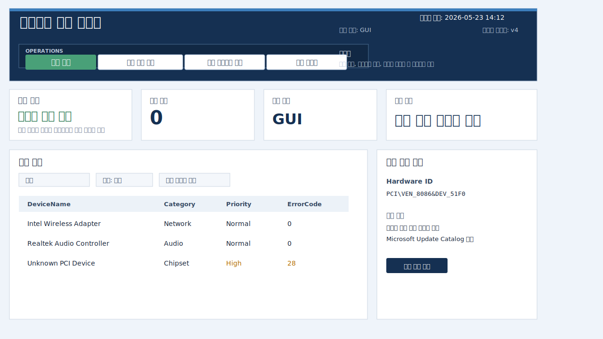

# Driver Check Helper

Windows 노트북이나 PC의 장치 상태를 점검하고, 필요한 드라이버를 찾기 쉽게 도와주는 PowerShell 기반 점검 도구입니다.

회사 업무에서 여러 제조사 노트북을 점검할 때 장치 관리자, 제조사 지원 페이지, Microsoft Update Catalog를 반복해서 확인해야 하는 불편함을 줄이기 위해 만들었습니다. 이 도구는 드라이버를 자동 설치하지 않고, 문제 장치와 검색 경로를 빠르게 정리해 주는 진단 보조 프로그램입니다.

## Project Summary

| Item | Description |
| --- | --- |
| Type | Windows driver inspection utility |
| Role | 개인 업무 자동화 프로젝트 / 설계, 구현, 테스트, 문서화 |
| Goal | 장치 상태 확인, 문제 장치 분류, 드라이버 검색 링크 생성 자동화 |
| Platform | Windows |
| Runtime | PowerShell |
| UI | Windows Forms 기반 GUI |

## Project Highlights

- 전체 장치 목록과 문제 장치 표시
- 장치 더블클릭 시 드라이버 검색 링크 열기
- 제조사/모델 기반 공식 지원 페이지 안내
- Hardware ID 기반 Microsoft Update Catalog 검색 링크 생성
- JSON/HTML 리포트 저장
- GUI 버전과 콘솔 버전 제공
- 제조사별 지원 페이지 매핑과 장치 분류 규칙 분리
- Pester 기반 PowerShell 테스트와 GitHub Actions workflow 포함

## Preview



> 공개 저장소용 샘플 화면입니다. 실제 장비명, 시리얼, Hardware ID, 리포트 로그는 포함하지 않았습니다.

## Why I Built This

Windows 장비를 점검할 때는 장치 관리자에서 문제 장치를 찾고, 장치 이름과 Hardware ID를 복사한 뒤, 제조사 페이지나 Microsoft Update Catalog에서 드라이버를 검색해야 합니다.

이 과정은 장비가 많아질수록 반복 작업이 되고, 제조사마다 지원 페이지 구조도 달라서 시간이 오래 걸립니다. 이 프로젝트는 그 반복을 줄이고, 점검 결과를 리포트로 남기기 위해 만들었습니다.

## Key Features

- 장치 상태 스캔
- 문제 장치 우선 정렬
- 장치 카테고리 추정
- 제조사 canonical name 정규화
- 제조사 지원 페이지 추천
- Microsoft Update Catalog 검색 URL 생성
- GUI 상세 패널
- JSON/HTML 리포트 생성
- 샘플 리포트와 스냅샷 예제 제공

## Tech Stack

| Area | Stack |
| --- | --- |
| Main runtime | PowerShell |
| GUI | Windows Forms |
| Wrapper | Python |
| Test | Pester |
| CI | GitHub Actions Windows runner |
| Report | JSON, HTML |

## Run

GUI 실행:

```powershell
.\run_driver_gui.bat
```

콘솔 실행:

```powershell
.\run_driver_scan.bat
```

직접 PowerShell로 실행:

```powershell
Set-ExecutionPolicy -Scope Process Bypass
.\main.ps1
```

Python 래퍼 실행:

```powershell
python .\main.py
```

## Test

```powershell
powershell -NoProfile -ExecutionPolicy Bypass -File .\tests\Run-Tests.ps1
```

GitHub Actions는 `.github/workflows/pester-tests.yml`에서 Windows runner 기준으로 테스트를 실행합니다.

## Output

실행 결과는 로컬에서 아래 폴더에 생성됩니다.

```text
reports/
logs/
```

이 저장소에는 실제 장비 정보가 들어갈 수 있는 실행 로그와 리포트는 포함하지 않습니다. 대신 `examples/` 아래에 샘플 리포트를 제공합니다.

## Project Structure

```text
driver-check-helper/
├── driver_gui.ps1                 # GUI entrypoint
├── main.ps1                       # Console scan entrypoint
├── main.py                        # Python wrapper
├── run_driver_gui.bat             # GUI launcher
├── run_driver_scan.bat            # Console launcher
├── scripts/
│   ├── main.analysis.functions.ps1
│   ├── main.report.functions.ps1
│   ├── main.system.functions.ps1
│   ├── gui.*.functions.ps1
│   └── rules/
│       ├── patterns.ps1
│       └── vendors.ps1
├── docs/
│   ├── manufacturer-support.md
│   └── report-schema.md
├── examples/
│   ├── sample-report.json
│   └── snapshots/
└── tests/
    └── Run-Tests.ps1
```

## Documentation

- [Report schema](docs/report-schema.md)
- [Manufacturer support](docs/manufacturer-support.md)
- [Sample report](examples/sample-report.json)
- [Sample preflight report](examples/sample-preflight-report.json)
- [GUI detail snapshots](examples/snapshots)

## Implementation Notes

- 장치 추정 규칙 로더는 `scripts/main.rules.ps1`입니다.
- 실제 분류 데이터는 `scripts/rules/` 아래에 나뉘어 있습니다.
- 분석 로직은 `scripts/main.analysis.functions.ps1`에 있습니다.
- 리포트 생성은 `scripts/main.report.functions.ps1`와 `scripts/report.schema.functions.ps1`에서 처리합니다.
- GUI 동작은 `scripts/gui.*.functions.ps1`로 기능별 분리했습니다.

## What I Learned

- Windows 장치 정보를 PowerShell에서 수집하고 정규화하는 방식
- Hardware ID와 제조사/모델 정보를 활용해 드라이버 검색 흐름을 자동화하는 방법
- GUI와 콘솔 실행 경로를 같은 분석 로직으로 유지하는 구조
- 실제 업무 도구는 기능뿐 아니라 리포트, 로그, 테스트, 예외 처리가 중요하다는 점

## Safety Notes

- 이 도구는 드라이버를 자동 설치하지 않습니다.
- 공식 지원 페이지와 검색 링크를 안내하는 진단 보조 도구입니다.
- 관리자 권한으로 실행하면 더 정확한 장치 정보를 확인할 수 있습니다.
- 공개 저장소에는 실제 실행 로그, 실제 장비 리포트, 복원 지점 백업을 포함하지 않습니다.
